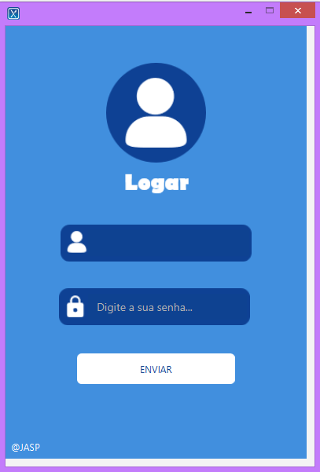
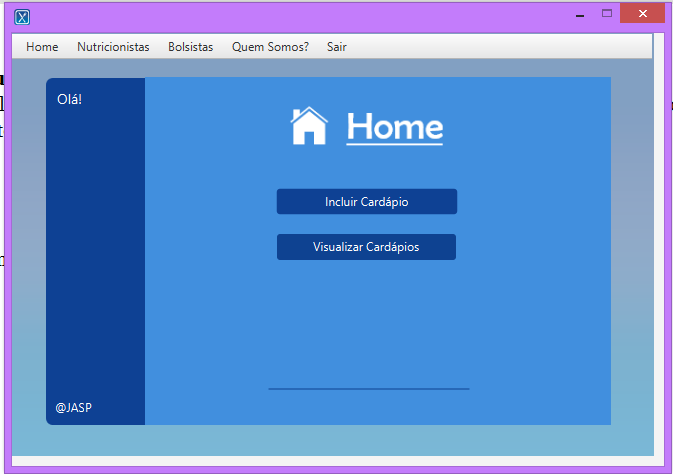
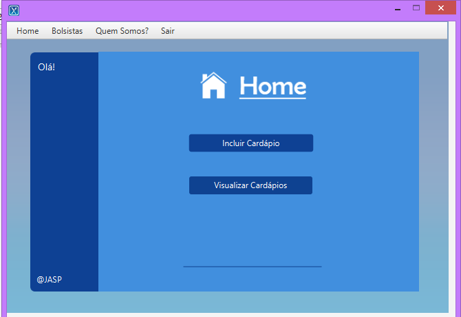
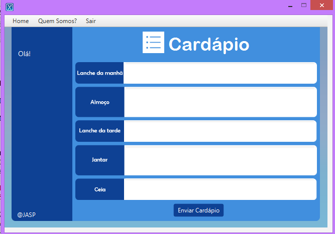

# APP_RU_OFFICIAL
University Restaurant APP, made for students know de menu of day-a-day in school.


<div align = 'center' width=100 height = 100>
    <p align='center'>
    
      <br>
      Play a song you like while you´re reading this :) <br>
      Welcome to RU APP!! Enjoy your stay! Hello, my name is Juliana and here it is a project that i made with my friends Andrelyne, Suellen and Pedro in my technician level in 2019. It was so cool to produce this, and right now after almost 3 years from that, i´m so
      in love with the result! So i´m sharing here for more people to see and be inspired...i dont know, let´s see whats gonna happen. This image above it´s the logo that we created :)
  </p>
      <br>
        
  <p> Screen above show the first screen of the app, the login screen, and oh an advice, it´s all in portuguese!
    Here you can put your username and your password to enter in system
</div>

- This version of the RU_APP was maded for people who works in universitary restaurant, that is, this is a computer software and was made for that. So, here the people who have acess are: Nutritionist, Chief Nutritionist and Nutrition Students.
- There exists in this repository and project: Home Screens, Register nutritionist or student, Register menu, Menu database, Nutritionist DataBase, Change your personal data...
- We use SQL connected with Java to do database, here it´s the link for the database: 📌[database_file_link](https://github.com/julianasantiago100/APP_RU_OFFICIAL/blob/master/BDAPPRU.sql)

<div align = 'center' width=100> 
    <br>
    <p> Nutri Chief HomeScreen </p>
    
    <br>
    <p> Nutri HomeScreen </p>
    
    <p> Student HomeScreen </p> 
    
</div>

<!-- 

<div align = 'center' width=100>
    
</div>


!!-->

<br>

**About JASP**

JASP is the name of group who produced this project. The group was create in 2019, where all of we study together in a discipline of your technician level called "Análise e Projeto de Desenvolvimento de Software" or, in english, "Analysis and Project of Software development". 
This was our final project of this discipline, where we learn for the first time programming language Java and OOP principles. For this work, we search between students in your school about the usability of this app, and also 
visit EAJ universitary restaurant for be more inside the needs and how everything could be designed.

***Here is the names of these legends :)*** 
```java
 System.out.println("Andrelyne Vitória Monteiro de Oliveira"); 

 System.out.println("Juliana Freire Pequeno de Santiago Carvalho");

 System.out.println("Pedro Lucas Olinto Moura");

 System.out.println("Sullen Maria Rodrigues de Lima");
```
***@Software developed by students of "Escola Agrícola de Jundiaí" (EAJ| ufrn)***
